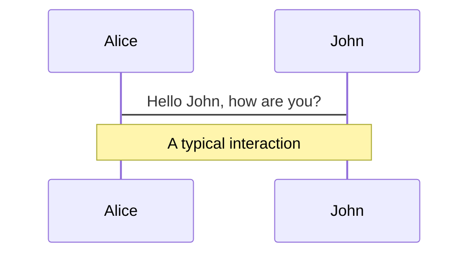
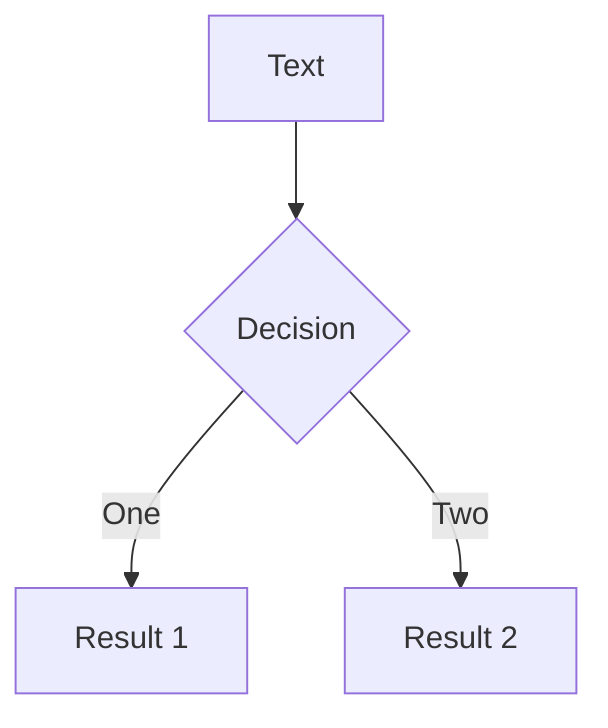
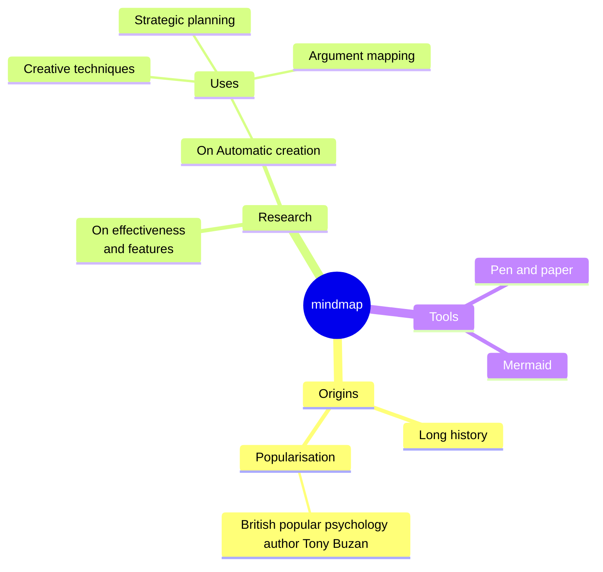
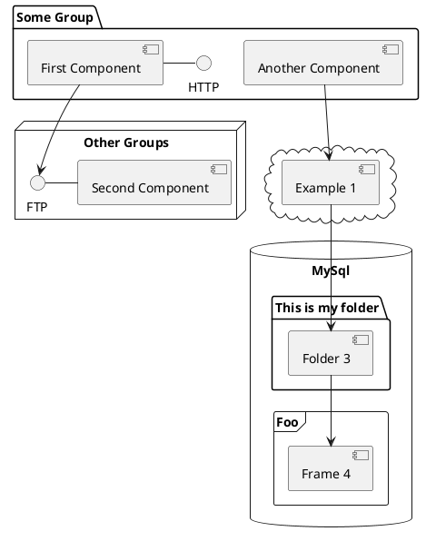

---
# You can also start simply with 'default'
theme: seriph
# random image from a curated Unsplash collection by Anthony
# like them? see https://unsplash.com/collections/94734566/slidev
background: https://cover.sli.dev
# some information about your slides (markdown enabled)
title: 欢迎来到Slidev
info: |
  ## Slidev入门模板
  面向开发人员的演示幻灯片.

  欲知详情，请浏览 [Sli.dev](https://sli.dev)
# apply unocss classes to the current slide
class: text-center
# https://sli.dev/features/drawing
drawings:
  persist: false
# slide transition: https://sli.dev/guide/animations.html#slide-transitions
transition: slide-left
# enable MDC Syntax: https://sli.dev/features/mdc
mdc: true
# open graph
# seoMeta:
#  ogImage: https://cover.sli.dev
---

# 欢迎来到Slidev

面向开发人员的演示幻灯片

<div @click="$slidev.nav.next" class="mt-12 py-1" hover:bg="white op-10">
  请按空格键查看下一页 <carbon:arrow-right />
</div>

<div class="abs-br m-6 text-xl">
  <button @click="$slidev.nav.openInEditor()" title="在编辑器中打开" class="slidev-icon-btn">
    <carbon:edit />
  </button>
  <a href="https://github.com/slidevjs/slidev" target="_blank" class="slidev-icon-btn">
    <carbon:logo-github />
  </a>
</div>

<!--
每张幻灯片的最后一个注释块将被视为幻灯片注释。
它将在演示者模式下与幻灯片一起显示和编辑。
[在文档中阅读更多内容](https://sli.dev/guide/syntax.html#notes)
-->

---
transition: fade-out
---

# 什么是Slidev？

Slidev是一个为开发人员设计的幻灯片制作和演示器，包括以下功能

- 📝 **Text-based** - 将重点放在Markdown的内容上，然后再对它们进行样式化
- 🎨 **Themable** - 主题可以作为NPM包共享和重用
- 🧑‍💻 **Developer Friendly** - 代码高亮显示，实时编码与自动完成
- 🤹 **Interactive** - 嵌入Vue组件来增强表达式
- 🎥 **Recording** - 内置录音和相机视图
- 📤 **Portable** - 导出到PDF， PPTX, png，甚至是可托管的SPA
- 🛠 **Hackable** - 在Slidev中几乎可以实现网页上的任何功能
<br>
<br>

阅读更多关于 [Why Slidev?](https://sli.dev/guide/why)

<!--
您可以在markdown中使用 `style` 标签来覆盖当前页面的样式。
Learn more: https://sli.dev/features/slide-scope-style
-->

<style>
h1 {
  background-color: #2B90B6;
  background-image: linear-gradient(45deg, #4EC5D4 10%, #146b8c 20%);
  background-size: 100%;
  -webkit-background-clip: text;
  -moz-background-clip: text;
  -webkit-text-fill-color: transparent;
  -moz-text-fill-color: transparent;
}
</style>

<!--
这是另一个评论.
-->

---
transition: slide-up
level: 2
---

# 导航

将鼠标悬停在左下角以查看导航的控制面板, [了解更多](https://sli.dev/guide/ui#navigation-bar)

## 键盘快捷键

|                                                     |                             |
| --------------------------------------------------- | --------------------------- |
| <kbd>right</kbd> / <kbd>space</kbd>                 | 下一个动画或幻灯片     |
| <kbd>left</kbd>  / <kbd>shift</kbd><kbd>space</kbd> | 之前的动画或幻灯片 |
| <kbd>up</kbd>                                       | 之前的幻灯片              |
| <kbd>down</kbd>                                     | 下一张                  |

<!-- https://sli.dev/guide/animations.html#click-animation -->

<p v-after class="absolute bottom-23 left-45 opacity-30 transform -rotate-10">Here!</p>

---
layout: two-cols
layoutClass: gap-16
---

# 目录表

您可以使用`Toc`组件为幻灯片生成内容表:

```html
<Toc minDepth="1" maxDepth="1" />
```

标题将从你的幻灯片内容推断出来，或者你可以在你的首页用 `title` 和`level`覆盖它。

::right::

<Toc text-sm minDepth="1" maxDepth="2" />

---
layout: image-right
image: https://cover.sli.dev
---

# 代码

使用代码片段并直接获得高亮显示，甚至类型悬停！

```ts {all|5|7|7-8|10|all} twoslash
// TwoSlash enables TypeScript hover information
// and errors in markdown code blocks
// More at https://shiki.style/packages/twoslash

import { computed, ref } from 'vue'

const count = ref(0)
const doubled = computed(() => count.value * 2)

doubled.value = 2
```

<arrow v-click="[4, 5]" x1="350" y1="310" x2="195" y2="334" color="#953" width="2" arrowSize="1" />

<!-- 这允许您嵌入外部代码块 -->
<<< @/snippets/external.ts#snippet

<!-- Footer -->

[Learn more](https://sli.dev/features/line-highlighting)

<!-- Inline style -->
<style>
.footnotes-sep {
  @apply mt-5 opacity-10;
}
.footnotes {
  @apply text-sm opacity-75;
}
.footnote-backref {
  display: none;
}
</style>

<!--
笔记也可以与点击同步

[click] 这将在第一次点击后突出显示

[click] 用 `count = ref(0)` 突出显示

[click:3] 最后一次点击（跳过两次点击）
-->

---
level: 2
---

# Shiki Magic Move

Powered by [shiki-magic-move](https://shiki-magic-move.netlify.app/), Slidev支持跨多个代码段的动画。

添加多个代码块并使用`<code>````md magic-move</code>`（四个反引号）包装它们以启用魔术移动。

For example:

````md magic-move {lines: true}
```ts {*|2|*}
// step 1
const author = reactive({
  name: 'John Doe',
  books: [
    'Vue 2 - Advanced Guide',
    'Vue 3 - Basic Guide',
    'Vue 4 - The Mystery'
  ]
})
```

```ts {*|1-2|3-4|3-4,8}
// step 2
export default {
  data() {
    return {
      author: {
        name: 'John Doe',
        books: [
          'Vue 2 - Advanced Guide',
          'Vue 3 - Basic Guide',
          'Vue 4 - The Mystery'
        ]
      }
    }
  }
}
```

```ts
// step 3
export default {
  data: () => ({
    author: {
      name: 'John Doe',
      books: [
        'Vue 2 - Advanced Guide',
        'Vue 3 - Basic Guide',
        'Vue 4 - The Mystery'
      ]
    }
  })
}
```

非代码块被忽略。

```vue
<!-- step 4 -->
<script setup>
const author = {
  name: 'John Doe',
  books: [
    'Vue 2 - Advanced Guide',
    'Vue 3 - Basic Guide',
    'Vue 4 - The Mystery'
  ]
}
</script>
```
````

---

# 组件

<div grid="~ cols-2 gap-4">
<div>

您可以直接在幻灯片中使用Vue组件。

我们提供了一些内置组件，如 `<Tweet/>` 和 `<Youtube/>` ，您可以直接使用。

添加自定义组件也非常容易。

```html
<Counter :count="10" />
```

<!-- ./components/Counter.vue -->
<Counter :count="10" m="t-4" />

Check out [the guides](https://sli.dev/builtin/components.html) for more.

</div>
<div>

```html
<Tweet id="1390115482657726468" />
```

<Tweet id="1390115482657726468" scale="0.65" />

</div>
</div>

<!--
主持人 使用 **bold**, *italic*, and ~~striked~~ 文字做备注.

此外，HTML元素也是有效的:
<div class="flex w-full">
  <span style="flex-grow: 1;">Left content</span>
  <span>Right content</span>
</div>
-->

---
class: px-20
---

# 主题

Slidev具有强大的主题支持。 主题可以为工具提供样式、布局、组件甚至配置。

在主题之间切换只需在你的frontmatter**一个编辑**：

<div grid="~ cols-2 gap-2" m="t-2">

```yaml
---
theme: default
---
```

```yaml
---
theme: seriph
---
```


</div>

阅读更多关于 [How to use a theme](https://sli.dev/guide/theme-addon#use-theme)
请查看 [Awesome Themes Gallery](https://sli.dev/resources/theme-gallery).

---

# 点击动画

你可以给元素添加 `v-click` 来添加点击动画。

<div v-click>

当你点击幻灯片时就会显示：

```html
<div v-click>当你点击幻灯片时就会显示出来.</div>
```

</div>

<br>

<v-click>

 <span v-mark.red="3"><code>v-mark</code> 指令</span>
还允许您添加
<span v-mark.circle.orange="4">内联标记</span>
, 由 [Rough Notation](https://roughnotation.com/) 提供支持:

```html
<span v-mark.underline.orange>inline markers</span>
```

</v-click>

<div mt-20 v-click>

[了解更多](https://sli.dev/guide/animations#click-animation)

</div>

---

# Motions

动态动画是由 [@vueuse/motion](https://motion.vueuse.org/), 由 `v-motion` 指令触发.

```html
<div
  v-motion
  :initial="{ x: -80 }"
  :enter="{ x: 0 }"
  :click-3="{ x: 80 }"
  :leave="{ x: 1000 }"
>
  Slidev
</div>
```

<div class="w-60 relative">
  <div class="relative w-40 h-40">
    
    
    
  </div>

  <div
    class="text-5xl absolute top-14 left-40 text-[#2B90B6] -z-1"
    v-motion
    :initial="{ x: -80, opacity: 0}"
    :enter="{ x: 0, opacity: 1, transition: { delay: 2000, duration: 1000 } }">
    Slidev
  </div>
</div>

<!-- Vue 的 `setup` 脚本可以直接在markdown中使用，并且只会影响当前页面 -->
<script setup lang="ts">
const final = {
  x: 0,
  y: 0,
  rotate: 0,
  scale: 1,
  transition: {
    type: 'spring',
    damping: 10,
    stiffness: 20,
    mass: 2
  }
}
</script>

<div
  v-motion
  :initial="{ x:35, y: 30, opacity: 0}"
  :enter="{ y: 0, opacity: 1, transition: { delay: 3500 } }">

[了解更多](https://sli.dev/guide/animations.html#motion)

</div>

---

# LaTeX

LaTeX是开箱即用的. Powered by [KaTeX](https://katex.org/).

<div h-3 />

内联 $\sqrt{3x-1}+(1+x)^2$

块
$$ {1|3|all}
\begin{aligned}
\nabla \cdot \vec{E} &= \frac{\rho}{\varepsilon_0} \\
\nabla \cdot \vec{B} &= 0 \\
\nabla \times \vec{E} &= -\frac{\partial\vec{B}}{\partial t} \\
\nabla \times \vec{B} &= \mu_0\vec{J} + \mu_0\varepsilon_0\frac{\partial\vec{E}}{\partial t}
\end{aligned}
$$

[了解更多](https://sli.dev/features/latex)

---

# 图

您可以直接在Markdown中从文本描述创建图表/图形。

<div class="grid grid-cols-4 gap-5 pt-4 -mb-6">









</div>

了解更多: [Mermaid Diagrams](https://sli.dev/features/mermaid) and [PlantUML Diagrams](https://sli.dev/features/plantuml)

---
foo: bar
dragPos:
  square: 710,22,167,_,-16
---

# 可拖动的元素

双击可拖动元素来编辑它们的位置。

<br>

###### 指令的使用

```md

```

<br>

###### 组件的使用

```md
<v-drag text-3xl>
  <div class="i-carbon:arrow-up" />
  使用 `v-drag` 组件来创建一个可拖动的容器！
</v-drag>
```

<v-drag pos="650,239,261,_,-15">
  <div text-center text-3xl border border-main rounded>
    双击我!
  </div>
</v-drag>


###### 可拖放箭头

```md
<v-drag-arrow two-way />
```

<v-drag-arrow pos="283,472,157,36" two-way op70 />

---
src: ./pages/imported-slides.md
hide: false
---

---

# Monaco Editor

Slidev提供内置的Monaco编辑器支持.

将`{monaco}`添加到代码块中以将其转换为编辑器:

```ts {monaco}
import { ref } from 'vue'
import { emptyArray } from './external'

const arr = ref(emptyArray(10))
```

使用`{monaco-run}`创建可以直接在幻灯片中执行代码的编辑器:

```ts {monaco-run}
import { version } from 'vue'
import { emptyArray, sayHello } from './external'

sayHello()
console.log(`vue ${version}`)
console.log(emptyArray<number>(10).reduce(fib => [...fib, fib.at(-1)! + fib.at(-2)!], [1, 1]))
```

---
layout: center
class: text-center
---

# 了解更多

[Documentation](https://sli.dev) · [GitHub](https://github.com/slidevjs/slidev) · [Showcases](https://sli.dev/resources/showcases)

<PoweredBySlidev mt-10 />
